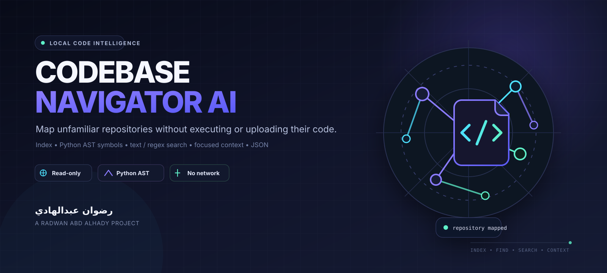

<div align="center">



<br/>


# Codebase Navigator AI

**Read an unfamiliar repository like a map — index it, find Python symbols, search its text, and inspect focused source context without executing or uploading the code.**

<br/>

[](https://github.com/rad03i2/codebase-navigator-ai/actions/workflows/ci.yml)


**[English](README_EN.md) · [العربية](README_AR.md) · [Architecture](docs/ARCHITECTURE.md) · [Roadmap](ROADMAP.md) · [Brand](docs/BRAND.md) · [Security](SECURITY.md)**

</div>

---

## The idea

Codebase Navigator AI is a **local-first developer CLI and small Python API** for exploring repositories without running the inspected project.

It builds an in-memory index of supported text/source files, extracts classes and functions from Python through the standard-library AST, supports literal or regular-expression search, filters by glob, and returns focused line context or JSON output.

> **About the “AI” name:** version 1.0 does not contain an LLM, embeddings backend, remote AI service, or hidden model call. The current engine is deterministic and local. Planned ideas are kept separately in [ROADMAP.md](ROADMAP.md).

## Four navigation primitives

<table>
<tr>
<td width="25%"><strong>Map</strong><br/><sub>Index supported repository files with safe size and count limits.</sub></td>
<td width="25%"><strong>Locate</strong><br/><sub>Discover Python classes, functions, and async functions through AST parsing.</sub></td>
<td width="25%"><strong>Search</strong><br/><sub>Run case-insensitive text search or opt-in regex across indexed files.</sub></td>
<td width="25%"><strong>Focus</strong><br/><sub>Read a narrow line window while rejecting paths outside the project root.</sub></td>
</tr>
</table>

## Current capabilities

| Capability | Current behavior |
|---|---|
| Recursive repository indexing | Yes |
| Common vendor/build ignores | Yes |
| Python class discovery | Yes |
| Python function discovery | Yes |
| Python async-function discovery | Yes |
| Compact Python signatures | Yes |
| Literal text search | Yes |
| Regex search | Yes |
| Glob path filtering | Yes |
| Focused source context | Yes |
| Human-readable CLI output | Yes |
| JSON CLI output | Yes |
| Python API | Yes |
| Symlink indexing | No |
| Project code execution | No |
| Imports from inspected code | No |
| Network / telemetry / API keys | No |
| Semantic embeddings | Not implemented |
| LLM integration | Not implemented |
| Persistent index | Not implemented |
| Semantic symbols for non-Python languages | Not implemented |

## Repository map flow

```text
repository root
      │
      ▼
recursive discovery
      │
      ├─ skip symlinks
      ├─ ignore common vendor/build folders
      ├─ keep supported text/source suffixes
      ├─ enforce file-count limit
      └─ skip files above the byte limit
      │
      ▼
UTF-8 text index
      │
      ├───────────────┬─────────────────┐
      ▼               ▼                 ▼
Python AST         text / regex       context
symbols            search             window
      │               │                 │
      └───────────────┴─────────┬───────┘
                                ▼
                    terminal or JSON output
```

## 30-second start

```bash
git clone https://github.com/rad03i2/codebase-navigator-ai.git
cd codebase-navigator-ai
python -m pip install -e .
codebase-nav --root . summary
```

Find Python symbols:

```bash
codebase-nav --root . symbols navigator
codebase-nav --root . symbols parser --kind function
```

Search code or documentation:

```bash
codebase-nav --root . search "timeout"
codebase-nav --root . search "def\\s+load" --regex --glob "*.py"
```

Inspect a focused source window:

```bash
codebase-nav --root . context src/app.py 42 --radius 5
```

Request structured output:

```bash
codebase-nav --root . --json symbols parser
```

> Global options such as `--root` and `--json` go before the subcommand.

## Python API

```python
from codebase_navigator import build_index, context, find_symbols, search_text

index = build_index(".")
print(index.summary())
print(find_symbols(index, "client"))
print(search_text(index, "timeout", glob="*.py"))
print(context(index, "src/app.py", 20, radius=2))
```

The API also exposes `max_files`, `max_bytes`, and `ignores` through `build_index(...)`. The CLI keeps the current safe defaults fixed.

## What gets indexed

The current source recognizes these suffixes for text search:

```text
.py .js .ts .tsx .jsx .java .go .rs .c .h .cpp .cs
.rb .php .md .toml .yaml .yml .json .txt
```

Common ignored directory names include:

```text
.git  .venv  venv  node_modules  dist  build  __pycache__  .pytest_cache
```

Files larger than **1,000,000 bytes** are skipped by default. The default maximum file count is **20,000**.

## Safety boundary

The inspected repository is treated as data:

- source files are read, not executed;
- Python files are parsed with `ast.parse`, not imported;
- symlinks are not indexed;
- context paths are resolved and must remain inside the indexed root;
- there is no network client, telemetry path, API-key requirement, or runtime dependency;
- malformed Python can fail AST parsing for that file, but the file can still participate in text search if it was read successfully.

This is **not** a malware scanner or sandbox. Use normal operating-system isolation when handling untrusted repositories. See [SECURITY.md](SECURITY.md).

## Tests and CI

The test suite currently covers indexing, symbol discovery, signatures, text search, glob filtering, context extraction, root validation, and traversal protection.

```bash
python -m compileall -q src tests
python -m unittest discover -s tests -v
codebase-nav --root . summary
```

GitHub Actions executes these checks on:

| OS | Python |
|---|---|
| Ubuntu | 3.10 · 3.12 · 3.13 |
| Windows | 3.10 · 3.12 · 3.13 |
| macOS | 3.10 · 3.12 · 3.13 |

## Project layout

```text
codebase-navigator-ai/
├── assets/
│   ├── project-cover.svg
│   └── project-logo.svg
├── docs/
│   ├── ARCHITECTURE.md
│   └── BRAND.md
├── src/codebase_navigator/
│   ├── __init__.py
│   ├── cli.py
│   └── core.py
├── tests/
│   └── test_core.py
├── .github/
│   ├── ISSUE_TEMPLATE/
│   ├── PULL_REQUEST_TEMPLATE.md
│   └── workflows/ci.yml
├── README_EN.md
├── README_AR.md
├── ROADMAP.md
├── CHANGELOG.md
├── CONTRIBUTING.md
├── SECURITY.md
└── LICENSE
```

## Documentation

| Document | Use |
|---|---|
| [README_EN.md](README_EN.md) | Full English guide |
| [README_AR.md](README_AR.md) | الدليل العربي الكامل |
| [docs/ARCHITECTURE.md](docs/ARCHITECTURE.md) | Indexing, symbols, search, context, and safety invariants |
| [docs/BRAND.md](docs/BRAND.md) | Code Atlas visual identity |
| [ROADMAP.md](ROADMAP.md) | Ideas that are not current features |
| [SECURITY.md](SECURITY.md) | Trust boundary and reporting guidance |
| [CONTRIBUTING.md](CONTRIBUTING.md) | Contribution workflow |
| [CHANGELOG.md](CHANGELOG.md) | Notable project changes |

---

<div align="center">

### Built by رضوان عبدالهادي

**Radwan Abd alhady Ahmed · [@rad03i2](https://github.com/rad03i2)**

<sub>Navigate structure first. Read focused context second. Keep private code local.</sub>

</div>
