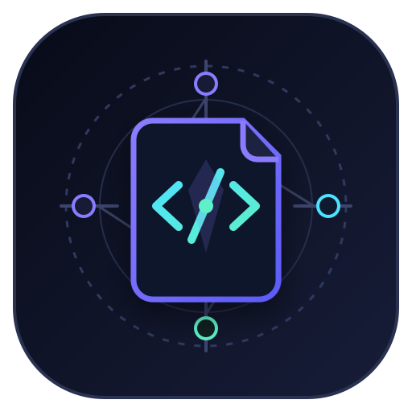

# Codebase Navigator AI — English Guide

<p align="center">
  
</p>

Codebase Navigator AI is a **local-first repository exploration CLI and Python API**. It indexes readable source/text files, extracts Python symbols with the standard-library AST, performs literal or regular-expression search, filters results by glob, and returns focused source context.

The inspected repository is not executed, imported, or uploaded.

## Important naming note

The project name includes “AI”, but version 1.0 uses deterministic local analysis. There is currently:

- no LLM integration;
- no embedding model;
- no vector database;
- no remote inference service;
- no API-key requirement.

Potential future semantic features are documented only in [ROADMAP.md](ROADMAP.md).

## Requirements

- Python 3.10+
- Read access to the repository being inspected
- No runtime third-party dependency

## Installation

```bash
git clone https://github.com/rad03i2/codebase-navigator-ai.git
cd codebase-navigator-ai
python -m pip install -e .
codebase-nav --version
```

## Commands

### Summary

```bash
codebase-nav --root /path/to/project summary
```

Returns the resolved root, number of indexed files, number of discovered Python symbols, and number of skipped files.

### Symbols

Search Python classes/functions by name:

```bash
codebase-nav --root . symbols service
codebase-nav --root . symbols handler --kind function
codebase-nav --root . symbols worker --kind async-function
```

Python symbol discovery uses `ast.parse`. The current symbol kinds are:

- `class`
- `function`
- `async-function`

Function signatures include parameter names but do not attempt full type/signature reconstruction.

### Search

Case-insensitive literal search:

```bash
codebase-nav --root . search "timeout"
```

Regex search:

```bash
codebase-nav --root . search "class\\s+Service" --regex
```

Filter indexed paths:

```bash
codebase-nav --root . search "TODO" --glob "*.py"
codebase-nav --root . search "architecture" --glob "**/*.md"
```

Matches are returned with relative path, line number, and a trimmed text preview capped by the implementation.

### Context

Read a focused line window:

```bash
codebase-nav --root . context src/app.py 42 --radius 5
```

The path must resolve inside the indexed root and must refer to a file that exists in the current index.

### JSON

Global `--json` goes before the subcommand:

```bash
codebase-nav --root . --json symbols parser
```

JSON output is useful for scripts that need structured results from summary, symbol, search, or context operations.

## Python API

```python
from codebase_navigator import build_index, context, find_symbols, search_text

index = build_index(
    ".",
    max_files=20_000,
    max_bytes=1_000_000,
)

print(index.summary())
print(find_symbols(index, "client"))
print(search_text(index, "timeout", glob="*.py"))
print(context(index, "src/app.py", 20, radius=2))
```

The public package exports:

- `Index`
- `Symbol`
- `Match`
- `build_index`
- `find_symbols`
- `search_text`
- `context`

## Indexing behavior

The default ignored directory names are:

```text
.git
.venv
venv
node_modules
dist
build
__pycache__
.pytest_cache
```

Supported suffixes are:

```text
.py .js .ts .tsx .jsx .java .go .rs .c .h .cpp .cs
.rb .php .md .toml .yaml .yml .json .txt
```

By default:

- the root must be an existing directory;
- at most 20,000 files can be indexed;
- files above 1,000,000 bytes are skipped;
- symlinks are skipped;
- unreadable or non-UTF-8 files are skipped;
- Python AST extraction is attempted only for `.py` files.

If the file-count limit is exceeded, indexing raises a runtime error instead of silently continuing.

## Security model

Codebase Navigator AI treats source as input data.

It does not:

- execute repository code;
- import inspected modules;
- compile the inspected project as part of analysis;
- follow symlinks into other locations;
- transmit source code to a service.

Context lookup resolves the requested path and rejects paths outside the repository root.

This reduces risk but does not make the tool a malware scanner. Refer to [SECURITY.md](SECURITY.md) when analyzing untrusted code.

## Testing

```bash
python -m compileall -q src tests
python -m unittest discover -s tests -v
codebase-nav --root . summary
```

CI runs on Ubuntu, Windows, and macOS with Python 3.10, 3.12, and 3.13.

## Current limitations

- semantic symbol extraction is Python-only;
- other supported languages participate in text search only;
- indexing is rebuilt for each CLI invocation;
- syntax-invalid Python produces no AST symbols for that file;
- there is no call graph;
- there is no type checker;
- there is no semantic embedding engine;
- there is no LLM assistant;
- there is no GUI.

See [ROADMAP.md](ROADMAP.md) for explicitly separated future ideas.

## License and author

MIT License — see [LICENSE](LICENSE).

**Radwan Abd alhady Ahmed**  
**رضوان عبدالهادي**  
GitHub: [@rad03i2](https://github.com/rad03i2)
